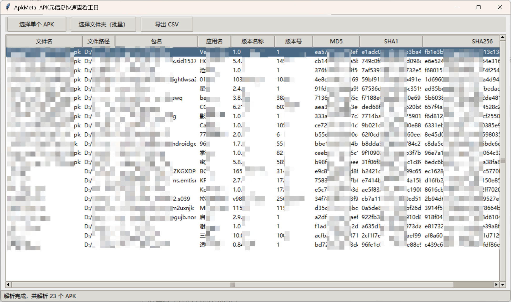

# ApkMeta – APK 元信息快速查看工具

`ApkMeta` 是一个基于 **Python + Tkinter + androguard** 的桌面小工具，用来**快速查看单个或批量 APK 的元信息**，并支持一键导出为 CSV。

> 🧩 本工具 **完全本地运行**，不会把 APK 上传到任何服务器。

---

## 🌈 界面预览（Screenshots）

### 主界面 · 批量解析 APK



> 上图示例：从文件夹批量导入多个 APK，表格中展示包名、版本、哈希等信息，并实时显示解析进度。

## 功能特性

- ✅ 支持 **单个 APK 文件解析**
- ✅ 支持 **选择文件夹，递归批量解析 APK**
- ✅ 自动计算并展示：
  - 文件名 / 文件路径  
  - 包名（packageName）  
  - 应用名（label / app name）  
  - 版本名称（versionName）  
  - 版本号（versionCode）  
  - MD5 / SHA1 / SHA256
- ✅ 表格展示，支持：
  - 双击单元格直接复制内容  
  - 右键菜单：复制当前单元格 / 复制整行  
  - 横向 / 纵向滚动浏览长内容
- ✅ 一键导出为 **CSV**（UTF-8-BOM，方便 Excel 打开）
- ✅ 内置简单状态栏：显示当前解析进度 & 导出提示

---

## 环境依赖

- Python 版本：**Python 3.7+**（建议 3.8+）
- 第三方库：
  - [`androguard`](https://pypi.org/project/androguard/) – 用于解析 APK
- 图形界面：
  - 标准库：`tkinter`（大多数 Python 发行版已自带）

> 💡 如果系统上没有 `tkinter`，需要自行安装或使用带 GUI 支持的 Python 环境。

---

## 安装

1. 克隆或下载本仓库代码：

```bash
git clone https://github.com/<your-name>/ApkMeta.git
cd ApkMeta
```

2. 安装依赖：

```bash
pip install androguard
```

如使用国内镜像，可例如：

```bash
pip install -i https://pypi.tuna.tsinghua.edu.cn/simple androguard
```

------

## 使用说明

### 启动程序

在项目目录中运行：

```bash
python ApkMeta.py
```

启动后会出现桌面窗口：**“ApkMeta  APK元信息快速查看工具”**

------

### 功能按钮

窗口顶部有三个主要按钮：

1. **「选择单个 APK」**
   - 选择一个 `.apk` 文件
   - 自动解析后在表格中展示一行数据（该 APK 的元信息）
2. **「选择文件夹（批量）」**
   - 选择一个文件夹
   - 程序会 **递归遍历子目录**，解析所有 `.apk` 文件
   - 解析结果逐行添加到表格中
   - 底部状态栏会实时更新当前正在解析的文件路径
3. **「导出 CSV」**
   - 将当前表格中的所有数据导出为 CSV 文件
   - 默认为 UTF-8-BOM 编码，兼容 Excel 直接打开
   - 每个单元格内容都自动做了引号转义，防止字段中含逗号导致格式混乱

------

### 表格交互

- **双击任意单元格**：
   → 直接将该单元格内容复制到剪贴板，并在底部状态栏显示提示。

- **右键单元格**：弹出菜单：

  - 「复制该单元格」
  - 「复制整行」

  同时当前行会高亮选中。

复制整行时，字段之间使用 **制表符（Tab）** 分隔，方便直接粘贴到 Excel、记事本等工具。

------

## 输出字段说明

每一行代表一个 APK 文件，包含以下字段：

| 字段名   | 说明                        |
| -------- | --------------------------- |
| 文件名   | APK 文件名（不含路径）      |
| 文件路径 | APK 的完整路径              |
| 包名     | 应用包名（`get_package()`） |
| 应用名   | 应用显示名称                |
| 版本名称 | `android:versionName`       |
| 版本号   | `android:versionCode`       |
| MD5      | 文件 MD5 哈希值             |
| SHA1     | 文件 SHA1 哈希值            |
| SHA256   | 文件 SHA256 哈希值          |

------

## 常见问题（FAQ）

### 1. 启动时报错：`未安装 androguard`

程序启动时会尝试 `from androguard.core.apk import APK`。
 如果未安装，会弹出错误提示框，请按照提示执行：

```bash
pip install androguard
```

然后重新运行脚本。

------

### 2. Windows 运行后窗口太小 / 不全屏？

程序会尝试：

```python
self.root.state("zoomed")
```

在部分系统 / 桌面环境下可能无效，此时默认会使用 `1200x700` 尺寸。
 你也可以自行拖拽调整窗口大小。

------

### 3. 支持哪些系统？

只要满足：

- 有 Python 3 环境
- 可用 Tkinter GUI
- 可以安装 `androguard`

理论上 Windows / macOS / 大多数 Linux 桌面发行版均可运行。
